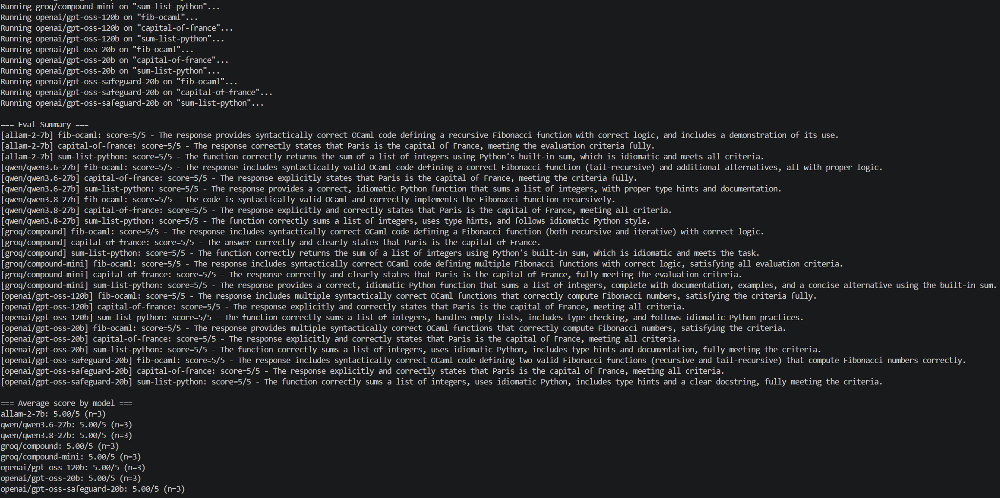
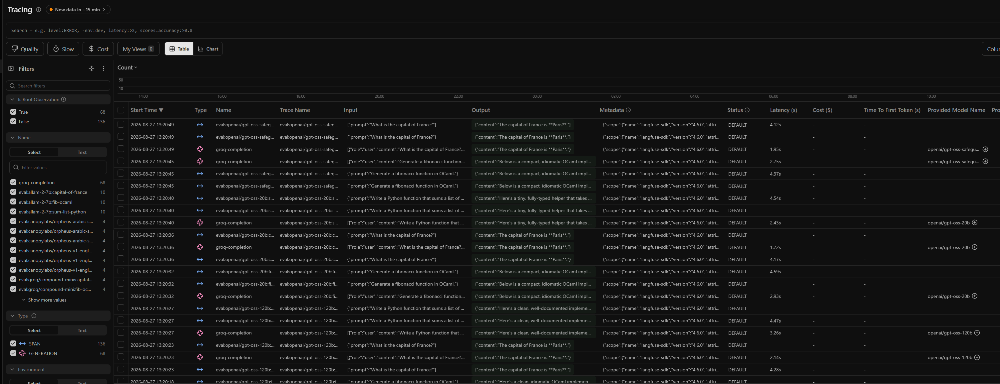

# poor-man-evals

A minimal LLM eval harness. Runs a prompt dataset against a list of models
hosted on [Groq](https://groq.com) and [NVIDIA NIM](https://build.nvidia.com),
scores each output with an LLM-as-judge, and logs every run + score to
[Langfuse](https://langfuse.com) so you get traces, comparisons, and dashboards
without building your own UI.







## How it works

```
src/
  instrumentation.js   Boots the Langfuse OpenTelemetry span processor (import first)
  throttle.js           Shared per-provider throttle + 429 retry-with-backoff
  content.js            Normalizes an OpenAI-compatible response into plain text
  groqClient.js         Thin wrapper around Groq's OpenAI-compatible chat completions API
  nvidiaClient.js       Same wrapper shape for NVIDIA NIM's OpenAI-compatible API
  providers.js           Maps a provider name ("groq", "nvidia") to its client (edit to add a provider)
  models.js              Models under test, tagged with their provider (edit this)
  datasets/text.js        Text prompts + judging criteria (edit this)
  datasets/image.js       Image prompts (base64 data URLs) + criteria (edit this)
  judge.js                LLM-as-judge: scores each output 1-5 against the criteria
  runEval.js              Orchestrates: for each model x each dataset item, run + score + log
test/                     Unit tests (node --test), no provider calls
scripts/                  verify-langfuse-v5.mjs: end-to-end check against a mock Langfuse
```

For every `(model, dataset item)` pair, `runEval.js`:
1. Applies the run's correlating attributes (`traceName`, `sessionId`, `tags`, `metadata`) with `propagateAttributes(...)`, then opens the trace's root observation. Langfuse v5 is observations-first, so these attributes land on the root *and* on every child observation.
2. Calls the model's provider with the prompt, logged as a `generation` observation (model, input, output, token usage). Because the generation inherits the session id, per-session cost aggregation works.
3. Calls the judge model to score the output 1-5 against the item's criteria.
4. Attaches the score to the generation observation via `langfuse.score.observation(...)` (observation-level scores are what v4 evaluators target).
5. Prints a summary table, including average score per model.

Failures are scoped per item and never abort the run: a model error or a judge
error marks just that item and the loop continues. If the judge cannot produce a
verdict (call failed, or unparseable JSON), the item is recorded as **UNSCORED**
under a separate `llm-judge-error` score and excluded from the averages, rather
than being written as a numeric `0` — which would be indistinguishable from a
genuinely bad model answer. Spans and scores are flushed in a `finally`, so even
a mid-run crash ships the traces collected so far.

Open your Langfuse project afterwards to see traces per run and compare models/scores in the UI.

Each run gets one generated session id (printed as `Langfuse session: ...`), so a run's traces group together in the Sessions view.

## Langfuse version

This project targets **Langfuse v4** with **JS/TS SDK v5+** (`@langfuse/*` `^5.11.1`), which requires **Node 20+**.

Notable v4/v5 behaviours this code relies on:

- Spans are exported over OTLP/HTTP to `/api/public/otel/v1/traces` (the v4 ingestion path) by `LangfuseSpanProcessor`.
- v5 applies a smart default span filter. Every span here is created by the Langfuse SDK, so the whole trace tree is exported; pass `shouldExportSpan: () => true` to `LangfuseSpanProcessor` in `src/instrumentation.js` if you later add non-Langfuse spans.
- Trace-level attributes are set with `propagateAttributes(...)` (the v5 replacement for `updateActiveTrace()`), and propagated `metadata` must be `Record<string, string>` with values <= 200 chars — which is why the (long) judging criteria live in the root observation's input.
- `environment` / `release` come from `LANGFUSE_TRACING_ENVIRONMENT` / `LANGFUSE_RELEASE`. `src/instrumentation.js` defaults the environment to `NODE_ENV`. This matters: the score writer reads the same variable, so traces and their scores stay in one environment.
- Base64 images in image cases are uploaded as Langfuse media and replaced with a media reference in span payloads.

Run `yarn verify:langfuse` to check all of the above against a local mock endpoint (no provider calls, no writes to your project).

## Setup

```bash
yarn install        # Node 20+
cp .env.example .env
```

Fill in `.env`:

```
GROQ_API_KEY=...            # https://console.groq.com/keys
NVIDIA_API_KEY=...          # https://build.nvidia.com (only needed for provider: "nvidia" models)
LANGFUSE_PUBLIC_KEY=...     # Langfuse project settings
LANGFUSE_SECRET_KEY=...
LANGFUSE_BASE_URL=https://cloud.langfuse.com   # or your self-hosted v4 URL
LANGFUSE_TRACING_ENVIRONMENT=development        # optional; defaults to NODE_ENV
JUDGE_MODEL=llama-3.3-70b-versatile             # optional, any chat model id
JUDGE_PROVIDER=groq                             # optional, "groq" or "nvidia"
```

## Configure your eval

- **Models to compare** — edit `src/models.js`. Each entry is
  `{ id, provider }`, where `provider` is `"groq"` or `"nvidia"`. A bare string
  still works and defaults to Groq. `MODELS_UNDER_TEST` drives the text dataset;
  `VISION_MODELS` drives the image dataset.
- **Prompts and pass/fail criteria** — edit `src/datasets/text.js` and
  `src/datasets/image.js`. Each item is `{ id, input, criteria }` (`image` items
  add a base64 `image` data URL); `criteria` is plain English describing what a
  good response looks like, which the judge model uses to score.
- **Adding a provider** — add a client module and one entry in `src/providers.js`,
  then tag models with the new name in `src/models.js`.
- **Turning a provider off** — set `ENABLED_PROVIDERS=groq` in `.env` (comma
  separated for several). Models stay in `src/models.js`; the harness just skips
  them and reports which providers it skipped.

## Run

```bash
yarn eval          # text dataset (default)
yarn eval:text     # text dataset
yarn eval:image    # image dataset (VISION_MODELS only)
```

To run both datasets in one go: `yarn eval:text && yarn eval:image`.

Console output looks like:

```
Running qwen/qwen3.8-27b (groq) on "fib-ocaml"...
Running meta/llama-3.1-8b-instruct (nvidia) on "fib-ocaml"...
Running qwen/qwen3.8-27b (groq) on "capital-of-france"...

=== Eval Summary ===
[qwen/qwen3.8-27b (groq)] fib-ocaml: score=5/5 - Provides correct, idiomatic OCaml...
[meta/llama-3.1-8b-instruct (nvidia)] fib-ocaml: score=4/5 - Recursive but no memoization...
[qwen/qwen3.8-27b (groq)] capital-of-france: score=5/5 - Correctly states Paris...

=== Average score by model ===
qwen/qwen3.8-27b (groq): 4.67/5 (n=3)
meta/llama-3.1-8b-instruct (nvidia): 4.00/5 (n=3)
```

Then check your Langfuse project's Traces view (filter by trace name prefix
`eval:`) to inspect individual runs, and the Scores view to compare
`llm-judge-score` across models.

## Rate limits

Groq's free tier is strict — some models allow as few as 10-30 requests per
minute, and token-per-minute caps as low as ~1.2K-8K depending on the model
(check current limits at https://console.groq.com/docs/rate-limits or your
console's Limits page). NVIDIA NIM limits vary by plan and model. Since this
harness makes one completion call + one judge call per dataset item, it's easy
to hit a 429 once you scale up models or the dataset.

To handle this, each client (`groqClient.js`, `nvidiaClient.js`) shares the
throttle in `src/throttle.js`:
- Waits at least `GROQ_MIN_REQUEST_INTERVAL_MS` / `NVIDIA_MIN_REQUEST_INTERVAL_MS`
  (default 2200ms each) between every request to that provider, including judge calls.
- On a 429, retries with exponential backoff (honoring the `Retry-After`
  header when the provider sends one — both the delay-seconds and the
  HTTP-date form) up to `GROQ_MAX_RETRIES` / `NVIDIA_MAX_RETRIES` times
  (default 5).
- Retries dropped connections (`ECONNRESET` etc.) on the same backoff, so a
  single network blip doesn't kill the run.
- Non-numeric values in these env vars fall back to the defaults instead of
  becoming `NaN`.

If you're still getting rate limited, either raise the relevant
`*_MIN_REQUEST_INTERVAL_MS` in `.env`, trim `src/models.js` / the dataset, or
move to a paid tier and lower the interval.

## Tests

```bash
yarn test              # unit tests: throttle/backoff, judge parsing, score building
yarn verify:langfuse   # end-to-end against a mock Langfuse server (no provider calls)
yarn check             # both
```

`yarn test` needs no API keys: `test/helpers/env.mjs` sets placeholder
credentials and every test stubs `globalThis.fetch`. `yarn verify:langfuse` runs
two scenarios — a healthy judge, and a judge returning unparseable output — and
asserts on the HTTP traffic that actually left the process, including that a
total judge failure still exports every trace.

## Troubleshooting

**NVIDIA: every model errors with `403 ... "detail":"Authorization failed"`**

This is an NVIDIA account entitlement problem, not a harness or model-id problem.
Your key can list models but not run inference. Note that NVIDIA's `GET /v1/models`
returns 200 **even with no `Authorization` header at all**, so a working model list
proves nothing — which is why the startup check also does a real 1-token
completion probe per provider.

The usual cause is a missing **"Public API Endpoints"** permission on your
personal NVIDIA organization. Request enablement on the
[NVIDIA developer forums](https://forums.developer.nvidia.com/t/383161), or use an
NVIDIA AI Enterprise org / self-hosted NIM container. Alternative: authenticate
via NVCF (`api.nvcf.nvidia.com`) with an NGC key.

Meanwhile, take NVIDIA out of the run without touching `src/models.js` by setting
`ENABLED_PROVIDERS=groq` in `.env`. Re-add `nvidia` once your key works.

**`Unknown dataset "..."`** — the id must match a `dataset id` export in
`src/datasets/`. Run `yarn eval:text` or `yarn eval:image`. Note that
`node src/runEval.js --dataset` with no value exits immediately instead of
reporting `Unknown dataset "undefined"`.

## Known limitations

- **The judge never sees the image.** Image items are scored from the model's
  *text* answer only — `judgeOutput` receives the prompt, the response and the
  criteria, but not the base64 image. Vision scores are therefore grades on the
  model's description, not on whether it read the image correctly. Pointing the
  judge at a vision-capable model and forwarding `item.image` is the fix if that
  matters for your eval.

## Notes / next steps

- The judge reuses Groq by default for convenience, but is provider-aware:
  set `JUDGE_PROVIDER=nvidia` (plus a matching `JUDGE_MODEL`) to run it on
  NVIDIA NIM, or point `judge.js` at a different provider entirely if you want a
  stronger judge than the models under test.
- Scores are numeric (1-5) LLM-judge scores attached to the generation
  observation. You can add deterministic scorers (exact match, regex, JSON
  schema validation, etc.) the same way — compute a value and call
  `langfuse.score.observation({ otelSpan }, ...)` with the observation you want
  to score.
- Langfuse's own [Datasets](https://langfuse.com/docs/evaluation/dataset-runs)
  feature can replace the arrays in `src/datasets/` once you outgrow them —
  useful if you want to manage the eval set from the Langfuse UI instead of code.
- Project-side v4 checks that still need a human: the **Evaluators** tab
  (legacy trace-level rules) and **Project Settings > Integrations** (blob
  storage / PostHog / Mixpanel exports). Both were empty when checked via the
  API, but the API does not expose every legacy target, so confirm in the UI
  before the v4 cutover.
